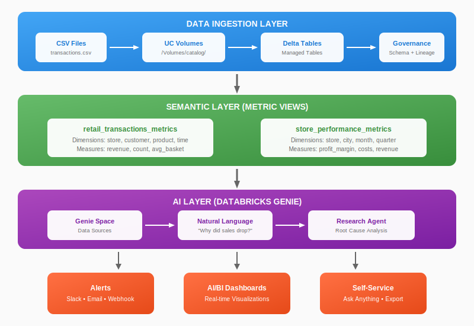
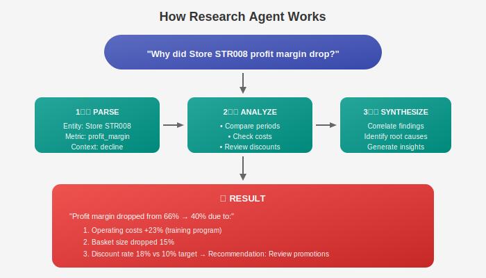
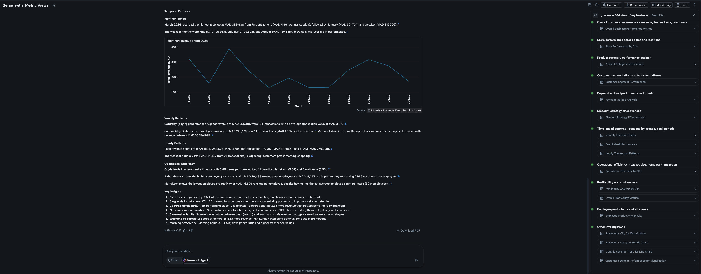
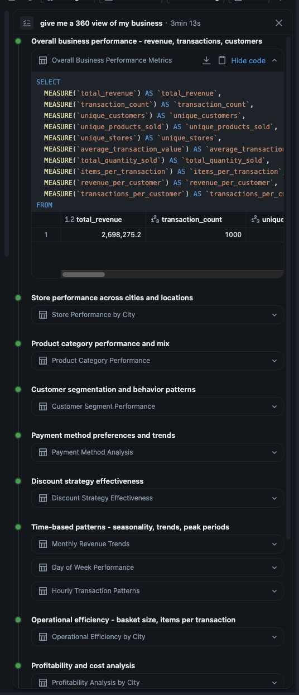

# Building AI-Powered Analytics with Databricks Metric Views, Genie & Research Agent

**Data Ingestion → Unity Catalog → Metric Views → Genie AI → Alerts & Research Agent**

---

## Complete Architecture



---

## The Problem

I am helping a retail company build AI-powered analytics in Databricks. One recurring challenge I noticed: **different teams report different numbers for the same KPI**. Marketing calculates revenue one way, Finance another, Operations a third.

The result? Confusion, delays, and poor decisions.

### Why Traditional Approaches Fail

Most organizations try to solve this by creating **multiple summary tables**:
- `sales_summary_marketing`
- `revenue_report_finance`  
- `daily_metrics_ops`

This creates **more problems**:
- **Data duplication** — Same metrics calculated multiple times
- **Definition drift** — Slight differences accumulate over time
- **Maintenance burden** — Every table needs updates when logic changes
- **No governance** — Hard to track which definition is "correct"

### The Better Way: Metric Views

**Databricks Metric Views** solve this by defining metrics **once** at the semantic layer:
- **Single definition** — One formula for `total_revenue`, used everywhere
- **No duplication** — Dimensions and measures computed at query time
- **Self-documenting** — Comments explain business logic
- **Governed** — Unity Catalog controls access and tracks lineage

Combined with **Genie AI**, anyone can query these standardized metrics using natural language.

Here's the complete end-to-end implementation.

> **Try it yourself:** [GitHub Repository](https://github.com/mwissad/databricks-genie-metricview) — Includes sample data, metric view YAML files, and step-by-step instructions.

---

## Part 1: Data Ingestion

### Load CSV into Unity Catalog

```python
# Read CSV and create Delta table
df = spark.read.csv("/Volumes/catalog/schema/raw_data/transactions.csv", 
                    header=True, inferSchema=True)

df.write.saveAsTable("my_catalog.my_schema.retail_transactions")
```

```sql
-- Add descriptions for governance
COMMENT ON TABLE my_catalog.my_schema.retail_transactions IS 
  'Transaction-level retail data including purchases and payments';
```

---

## Part 2: Creating Metric Views

> [Official Documentation](https://docs.databricks.com/en/metric-views/)

### What Are Metric Views?

A **semantic layer** that transforms raw tables into standardized, governed business metrics.

| Component | What It Does | Example |
|-----------|--------------|---------|
| **Source** | Points to your table | `my_catalog.my_schema.transactions` |
| **Dimensions** | Slice/filter data | `store_city`, `customer_segment` |
| **Measures** | Aggregated KPIs | `SUM(TotalAmount)`, `COUNT(DISTINCT CustomerID)` |
| **Comments** | Context for AI | "Total revenue from all transactions" |

### Create via Catalog Explorer

**Navigate to:** Catalog → Schema → **Create** → **Metric View**

```yaml
version: 1.1
source: my_catalog.my_schema.retail_transactions

dimensions:
  - name: store_city
    expr: StoreCity
    comment: City where the store is located
  - name: customer_segment
    expr: CustomerSegment
    comment: "Customer segment (VIP, Premium, Regular, New)"
  - name: category
    expr: Category
    comment: Product category

measures:
  - name: total_revenue
    expr: SUM(TotalAmount)
    comment: Total revenue from all transactions
  - name: transaction_count
    expr: COUNT(*)
    comment: Number of transactions
  - name: unique_customers
    expr: COUNT(DISTINCT CustomerID)
    comment: Number of unique customers
  - name: average_basket_size
    expr: AVG(TotalAmount)
    comment: Average transaction value
```

### Grant Access

```sql
GRANT SELECT ON METRIC VIEW my_catalog.my_schema.retail_metrics TO `analysts`;
```

---

## Part 3: Setting Up Genie

> [Genie Documentation](https://docs.databricks.com/en/genie/)

### Create a Genie Space

1. **Workspace** → **New** → **Genie Space**
2. Add your metric views as data sources
3. Add business context instructions

### Example Queries

| You Ask | Genie Does |
|---------|------------|
| "Total revenue last month?" | Queries `total_revenue` metric |
| "Which stores have low margins?" | Filters `average_profit_margin < 50` |
| "Compare VIP vs Regular spending" | Groups by `customer_segment` |
| "Why did Store STR008 underperform?" | **Triggers Research Agent** |

---

## Part 4: Research Agent

> [Research Agent Documentation](https://docs.databricks.com/aws/en/genie/research-agent)

Traditional BI answers **"what happened."**  
The **Research Agent** answers **"why it happened"** and **"what to do about it."**

### What is Research Agent?

Research Agent is Genie's advanced analytical capability that performs **multi-step investigation** to answer complex questions. When you ask "why" or "analyze", Genie:

1. **Breaks down** the question into sub-queries
2. **Investigates** multiple dimensions and time periods
3. **Correlates** findings across metrics
4. **Synthesizes** insights with recommendations

### How It Works



Research Agent triggers automatically on "why", "explain", or "analyze" questions.

---

## Real Results: "Give me a 360 view of my business"

I tested this with a simple question: **"Give me a 360 view of my business"**



<!-- For LinkedIn: Upload this image manually from docs/images/genie-360-view.png -->

### What Genie Delivered

In **3 minutes**, Genie automatically generated:

- **Monthly Revenue Trends** — Peak in March (MAD 386K), dips in mid-year
- **Weekly Patterns** — Saturday generates highest revenue (MAD 685K)
- **Hourly Insights** — Peak hours: 9 AM, 10 AM, 11 AM
- **Operational Efficiency** — Oujda leads with 5.89 items per transaction
- **Key Insights** — Electronics = 95% of revenue, 3x seasonal volatility

### Genie's Analysis Steps

From one question, Genie created **10+ analyses**:

| Category | Analysis |
|----------|----------|
| Overall Performance | Revenue, Transactions, Customers |
| Store Performance | Performance by City |
| Product Mix | Category Performance |
| Customer Segmentation | Behavior Patterns |
| Payment Methods | Preferences & Trends |
| Discount Strategy | Effectiveness Analysis |
| Time Patterns | Monthly, Weekly, Hourly Trends |
| Operational Efficiency | Basket Size, Items per Transaction |
| Profitability | Cost Analysis by City |

### The SQL Genie Created and the reasoning Steps



<!-- Save screenshot as docs/images/genie-sql-example.png -->

```sql
SELECT
  MEASURE(`total_revenue`) AS `total_revenue`,
  MEASURE(`transaction_count`) AS `transaction_count`,
  MEASURE(`unique_customers`) AS `unique_customers`,
  MEASURE(`unique_products_sold`) AS `unique_products_sold`,
  MEASURE(`unique_stores`) AS `unique_stores`,
  MEASURE(`average_transaction_value`) AS `average_transaction_value`,
  MEASURE(`total_quantity_sold`) AS `total_quantity_sold`,
  MEASURE(`items_per_transaction`) AS `items_per_transaction`,
  MEASURE(`revenue_per_customer`) AS `revenue_per_customer`,
  MEASURE(`transactions_per_customer`) AS `transactions_per_customer`
FROM
  `catalog`.`schema`.`retail_transactions_metric_view`
GROUP BY
  ALL
```

**Key point:** Genie uses the `MEASURE()` function to query the pre-defined measures from the metric view. No need to remember `SUM(TotalAmount)` — just reference `total_revenue`.

---

## Part 5: Setting Up Alerts

> [SQL Alerts](https://docs.databricks.com/en/sql/user/alerts/)

### Create Alert Query

```sql
SELECT store_id, city, average_profit_margin
FROM my_catalog.my_schema.store_performance_metrics
WHERE average_profit_margin < 45
   OR cost_to_revenue_ratio > 0.55
ORDER BY average_profit_margin ASC
```

### Configure Alert

1. Save query → Click **Alert** (bell icon)
2. Trigger: "Query returns results"
3. Frequency: Every hour
4. Destination: Slack, Email, or Webhook

---

## The Shift

| Traditional BI | With Metric Views + Genie |
|----------------|---------------------------|
| SQL required | Natural language |
| Static dashboards | Conversational insights |
| Reactive reporting | Proactive alerts |
| "What happened?" | "Why did it happen?" |
| Days to insight | Seconds to insight |

---

## Resources

**GitHub Repository:**
- [mwissad/databricks-genie-metricview](https://github.com/mwissad/databricks-genie-metricview) — Sample data, YAML files, and step-by-step guide

**Metric Views:**
- [Overview](https://docs.databricks.com/en/metric-views/)
- [YAML Syntax](https://docs.databricks.com/en/metric-views/yaml-ref)
- [Create via UI](https://docs.databricks.com/en/metric-views/create/ui)

**Genie:**
- [Overview](https://docs.databricks.com/en/genie/)
- [Create Genie Space](https://docs.databricks.com/en/genie/create-genie-space.html)
- [Research Agent](https://docs.databricks.com/aws/en/genie/research-agent)

**Alerts:**
- [SQL Alerts](https://docs.databricks.com/en/sql/user/alerts/)

---

*#Databricks #Analytics #AI #MetricViews #Genie #DataEngineering #BusinessIntelligence*

---

**About the Author:**
*Mehdi Wissad is a Databricks Solution Architect. Connect with me to discuss implementing metric views in your organization.*
